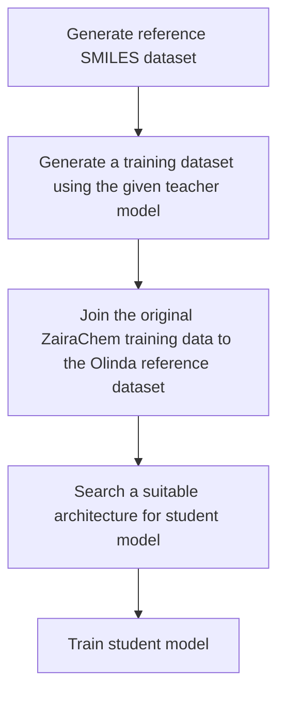

# Olinda

Olinda is a generic cheminformatics model distillation library.
It can automatically distill models from Pytorch, Tensorflow, ONNX amd ZairaChem formats.

## Getting Started

### Pytorch, Tensorflow, ONNX models
Create a conda environment

```bash
conda create -n olinda python=3.10
conda activate olinda
```

Clone the Olinda repository and install it

```bash
git clone https://github.com/ersilia-os/olinda.git
cd olinda
python -m pip install -e .
```

### ZairaChem models
To distill ZairaChem models, install the [ZairaChem](https://github.com/JHlozek/zaira-chem.git) pipeline which installs Olinda into the same environment


## Usage
Within the conda environment, models can be distilled quickly with a single function:

```
olinda distill -m path_to_model -o path_to_save.onnx
```

Alternatively, you can run the distillation in Python code:

```python
from olinda import Distiller

d = Distiller()
student_model = d.distill("path_to_model")
student_model.save("path_to_save.onnx")
```

Use the 'num_data' parameter (or -t flag in the cli) to specify a smaller training dataset to test the pipeline.

```python
student_model = distill("path_to_model", num_data=1000)
```

## Run ONNX inference with Python api
Model inference can be run from the cli with the predict command by specifying an input csv file with a 'smiles' column.

```
olinda predict -i input_file.csv -m path_to_model -o output_file.csv
```

A lite version for running model predictions can be found by installing the onnx_runner package.
```bash
cd onnx_runner
python -m pip install -e .
```

Then run predictions in Python with:
```
import onnx_runner
model = onnx_runner.ONNX_Runner("path/to/model.onnx")
model.predict(["CCC", "CCO"])
```


### How the distillation works?

The distillation function first downloads a reference SMILES dataset if it is not already present. It then generates featurized inputs using the reference SMILES dataset for training the student model. Next it uses the provided teacher model to generate input-output pairs. The input-output pairs together with the featurized inputs constitute the training dataset for the student model. Finally a suitable architecture for the student model is selected using heuristics and the selected model is trained using the training dataset.



During the distillation process, helpful messages and progress bars are printed to keep the user informed. In the case of a crash or process interruption the distillation process can be resumed automatically. It caches all the intermediate results in a local directory (`xdg_home() / olinda`).

The student model is trained on a library of 100k molecules from ChEMBL 29, where ZairaChem descriptors have been pre-calculated in folds of 50k molecules and stored in S3 buckets. At runtime, Olinda will download the required number of folds, if not already present on the system.

Distilled models are returned in ONNX format for cross-platform use.


## License
This project is licensed under GNU AFFERO GENERAL PUBLIC LICENSE Version 3.

## About
The [Ersilia Open Source Initiative](https://ersilia.io) is a Non Profit Organization (1192266) with the mission is to equip labs, universities and clinics in LMIC with AI/ML tools for infectious disease research.

[Help us](https://ersilia.io/model-hub) achieve our mission!


### TODO

#### Poetry install fails on m1 macs

```bash
CMAKE_ARGS="-DONNX_USE_PROTOBUF_SHARED_LIBS=OFF -DProtobuf_USE_STATIC_LIBS=ON" poetry install
```

- [ ] ErsiliaModel compatibility (Currently hard-coded for eos97yu. Ersilia models require an output adapter to standardise prediction formatting)
- [ ] Multi-output models
