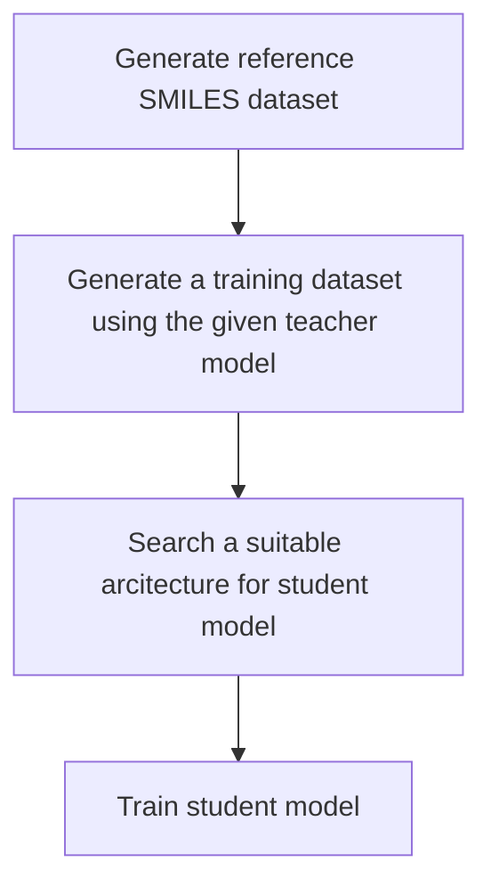

# Olinda

Olinda is a generic cheminformatics model distillation library.
It can automatically distill models from Pytorch, Tensorflow, ONNX amd models fetched directly from the Ersilia Hub.

## Getting Started

Olinda is available on PyPi and can be installed using pip.

```bash
pip install olinda
```

Models can be distilled quickly with a single function

```python
from olinda import distill

student_model = distill(your_model)
```

### How the distillation works?

The distillation function first downloads a reference SMILES dataset if it is not already present. It then generates featurized inputs using the reference SMILES dataset for training the student model. Next it uses the provided teacher model to generate input-output pairs. The input-output pairs together with the featurized inputs constitute the training dataset for the student model. Finally a suitable architecture for the student model is selected using heuristics and the selected model is trained using the training dataset.



During the distillation process, helpful messages and progress bars are printed to keep the user informed. In the case of a crash or process interruption the distillation process can be resumed automatically. It caches all the intermediate results in a local directory (`xdg_home() / olinda`).

## Distillation customization

The distillation API is very flexible and covers a wide varietry of use cases. User can easily customize the distillation behavior by passing parameters to the `distill` function.

```python
def distill(
    model: Any,
    featurizer: Optional[Featurizer],
    working_dir: Path,
    clean: bool = False,
    tuner: ModelTuner = AutoKerasTuner(),
    reference_smiles_dm: Optional[ReferenceSmilesDM] = None,
    featurized_smiles_dm: Optional[FeaturizedSmilesDM] = None,
    generic_output_dm: Optional[GenericOutputDM] = None,
) -> pl.LightningModule:
    """Distill models.

    Args:
        model (Any): Teacher Model.
        featurizer (Optional[Featurizer]): Featurizer to use.
        working_dir (Path): Path to model workspace directory.
        clean (bool): Clean workspace before starting.
        tuner (ModelTuner): Tuner to use for selecting and optimizing student model.
        reference_smiles_dm (Optional[ReferenceSmilesDM]): Reference SMILES datamodules.
        featurized_smiles_dm (Optional[FeaturizedSmilesDM]): Reference Featurized SMILES datamodules.
        generic_output_dm (Optional[GenericOutputDM]): Precalculated training dataset for student model.

    Returns:
        pl.LightningModule: Student Model.
    """

```

### Custom SMILES reference dataset

This will skip generating a featurized input dataset and use the provided one.

```python
from olinda import distill
from olinda.data import ReferenceSmilesDM

# Wrap your dataset in a datamodule class from pytorch lightning
# or use the provided `ReferenceSmilesDM` class
custom_reference_dm = ReferenceSmilesDM()
student_model = distill(your_model, reference_smiles_dm=custom_reference_dm)
```

### Custom featurizer for student model inputs

```python
from olinda import distill
from olinda.featurizer import Featurizer, Flat2Grid

# Implement your own featurizer by inheriting the `Featurizer` abstract class
# or use one of the provided Featurizers
student_model = distill(your_model, featurizer=Flat2Grid())
```

### Custom featurized input dataset

This will skip generating a featurized input dataset and use the provided one.

```python
from olinda import distill
from olinda.data import FeaturizedSmilesDM

# Wrap your dataset in a datamodule class from pytorch lightning
# or use the provided `FeaturizedSmilesDM` class
custom_reference_dm = FeaturizedSmilesDM()
student_model = distill(your_model, featurized_smiles_dm=custom_reference_dm)
```

### Custom student model training dataset

This will skip generating a student model training dataset and use the provided one.

```python
from olinda import distill
from olinda.data import GenericOutputDM

# Wrap your dataset in a datamodule class from pytorch lightning
# or use the provided `GenericOutputDM` class
custom_student_training_dm = GenericOutputDM()
student_model = distill(your_model, generic_output_dm=custom_student_training_dm)
```

### Custom Tuners for student model tuning

Olinda provides multiple Tuners out of the box. Custom tuners can also be implemented using the `ModelTuner` interface.

```python
from olinda import distill
from olinda.tuner import KerasTuner


student_model = distill(your_model, tuner=KerasTuner())
```

## DataModules

## Featurizers

## Tuners

## TODO

## FAQs

### Poetry install fails on m1 macs

```bash
CMAKE_ARGS="-DONNX_USE_PROTOBUF_SHARED_LIBS=OFF -DProtobuf_USE_STATIC_LIBS=ON" poetry install
```

- [ ] Model compatibility
  - [x] Pytorch
  - [ ] Tensorflow
  - [ ] ONNX
  - [ ] ErsiliaModel ID
- [x] Caching intermediate results
  - [x]  Dataloader object using joblib
  - [x]  Separate folders for models+distill params
  - [x]  Separate folders for reference+featurizer
- [x]  Support custom featurizers
- [ ]  Support custom input types to the featurizer
  - [ ]  Input types can vary but the output is always of same dimensions
- [ ]  Custom tuners for model search and optimization
  - [ ]  Support chemxor models
- [ ]  DataModules
  - [ ] Add a split percentage parameter to the datamodules
- [x] Skip generating model outputs and use provided datamodule

- flatten images and check with previous tuners