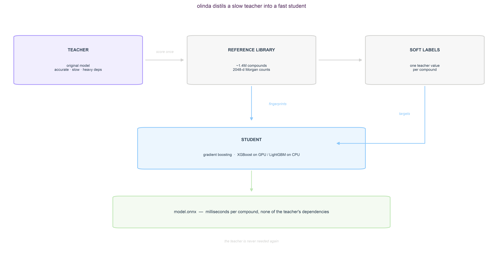
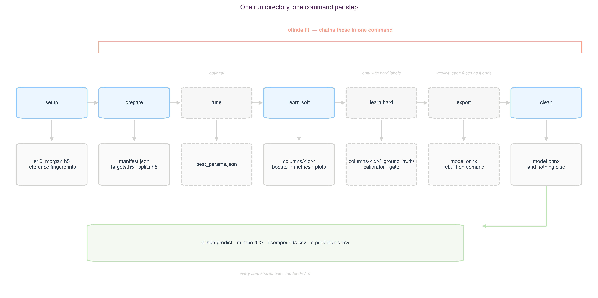

# Olinda, model distillation for chemistry

Some models are too slow to run on a million compounds. Olinda makes a fast one that behaves like
them: score the slow model once over a reference library of ~1.4M molecules, train a compact
gradient-boosting student to reproduce it, and ship the result as a single ONNX file.



## Installation

```bash
pip install olinda                 # inference only: numpy, pandas, rdkit, onnxruntime
pip install "olinda[report]"       # + validate a model you were given, and the CLI
pip install "olinda[train]"        # + distil your own (the boosting stack)
```

Running a model should never drag in a plotting stack, so the tiers are separate. `[train]` includes
`[report]`, since a training run draws its own figures. CI installs each tier on its own and
exercises it, so the boundaries are real rather than aspirational.

## Running a model at inference time

A distilled model is one self-describing file. The featurizer, the RDKit build it needs, the task
names — all of it travels inside the `.onnx`, so nothing else is required to run it.

```python
from olinda import OlindaArtifact

model = OlindaArtifact("model.onnx")
model.run(["CCO", "c1ccccc1"])  # DataFrame: smiles + one column per task
```

## Distilling a model (soft labels)

Fetch the reference library once (~2.8 GB), then fit:

```bash
olinda setup
olinda fit -s teacher.csv -m runs/my_model.onnx
olinda predict -m runs/my_model.onnx -i compounds.csv -o predictions.csv
```

`-m` names the artifact you want. `fit` builds the run in `runs/my_model/` beside it and deletes that
folder once everything has fused, so what you keep is one file.

`teacher.csv` holds a `smiles` column plus one or more value columns, covering **exactly the
reference-library molecules in the same order** — olinda verifies this and refuses otherwise.

Up to **10 teacher columns** in one file. Each becomes an independent student, and all of them fuse
into one `model.onnx` with one output per task. A single column is just the one-column case; there is
no separate mode.

### Try it on a handful of molecules first

A full run trains on 1.36M compounds and takes a while, so check the plumbing before you commit to
it. `--max-samples` truncates the library to its first N rows, which shrinks every stage — the split,
the boosting, the hard head's calibration and the gate:

```bash
olinda fit -s teacher.csv -m runs/check.onnx --max-samples 1000    # ~a minute
olinda predict -m runs/check.onnx -i a_few_molecules.csv -o out.csv
```

The result is a real, servable `model.onnx` — just a bad one, fitted on a thousandth of the data. Use
it to confirm your teacher file is accepted, your columns are matched the way you expect and the
predictions come out where you want them. Then drop the flag for the real thing:

```bash
olinda fit -s teacher.csv -h measured.csv -m runs/my_model.onnx    # hours, on everything
```

Both paths are scripted end-to-end in [`example/run.sh`](example/run.sh) (`./run.sh check` for the
fast version, `./run.sh` for the full one). [`example/run_stepwise.sh`](example/run_stepwise.sh) walks
the same distillation one command at a time, so you can stop after the surrogate, look at what it
learned, and only then decide to add the hard-label head.

### Hard labels (your own measurements)

If you also have real measurements, pass them with `-h`:

```bash
olinda fit -s teacher.csv -h measured.csv -m runs/my_model.onnx
```

`measured.csv` is a `smiles` column plus one column per assay, left empty where a compound was not
tested. Columns are matched to the teacher by name, allowing a suffix — `abaumannii_inhibition`
matches `abaumannii_inhibition_probability`. Anything ambiguous is an error, not a guess.

Olinda then trains a classifier on your labels, calibrates it onto the teacher's scale (learning the
direction from the data), and learns where to trust it. The final prediction is

```
(1 − a) · surrogate  +  a · calibrated hard labels
```

`a` rises only near chemistry you have actually measured. Rather than search your labelled set for
every query, olinda measures each reference compound's nearest-neighbour Tanimoto to it once, at
training time, and fits a small network to predict that number from a fingerprint alone — so your
compounds never travel inside the shipped model. A ramp turns the predicted similarity into `a`,
continuously: nothing jumps at a threshold.

How far `a` can ever rise is earned, not assumed. A hard head whose calibrated output tracks the
teacher poorly is capped low, and one that loses to the surrogate outright is dropped, leaving the
column soft-only. Far from your data the model falls back to the surrogate. That weighting is already
inside the number `run()` returns.

## Is it any good?

`validate` scores a finished model against data of your choosing and writes a report — figures, a
`metrics.json`, and a `performance_table.csv`:

```bash
olinda validate -m runs/my_model.onnx -s heldout_teacher.csv -h measured.csv -o report/
```

Unlike the teacher file `fit` takes, these labels have **no size or ordering restriction** — any
SMILES with values, matched to the model's tasks by name. Held-out data is the point: the surrogate's
isotonic correction is fitted on the run's own validation rows, so only new data measures the
calibrated model honestly. If the compounds turn out to be the training library, the report says so
rather than letting you read fit as generalisation.

`-s` gives correlation, residual and calibration diagnostics; `-h` gives ROC, precision–recall and
enrichment — of the **blended** output, which is what `predict` emits, not the hard-label head on
its own. With neither, you still get the model's own calibration curves, read straight out of the
graph.

## Commands

The four you normally need:

| | |
|---|---|
| `setup` | Download the reference-library fingerprints to `~/.olinda/` |
| `fit` | Distil a teacher into one `model.onnx` |
| `predict` | Run a model over a file of SMILES |
| `validate` | Score a model against labelled data and write a report |

`fit` chains the steps below. Each is also a command in its own right — run them one at a time when you
want the per-column boosters, metrics and plots that `fit` discards:

| | |
|---|---|
| `prepare` | Read the teacher columns and plan each one's split |
| `tune` | Optional Optuna pass; single-column runs only |
| `learn-soft` | Train the surrogate for every column |
| `learn-hard` | Train and calibrate the hard-label head |
| `export` | Rebuild `model.onnx` from a trained run |
| `clean` | Move the model out and delete the run folder |

`fit`, `predict` and `clean` take `-m` as a path to the **`.onnx`**; the pipeline steps between them
take `-m` as the **run folder** they share. The engine is picked from your hardware — XGBoost on a
CUDA GPU, LightGBM on CPU — and `OLINDA_BACKEND` overrides it.



## How it fits together

Two more diagrams, for when the shape of the thing matters more than the commands: what ends up
inside the artifact, and how the hard-label head is calibrated and gated.

| | |
|---|---|
| [The fused artifact](docs/diagrams/olinda_03_model_onnx.png) | Every stage in one graph, and what the metadata carries |
| [Hard labels and applicability](docs/diagrams/olinda_04_hard.png) | The four `learn-hard` steps, and where `a` comes from |

They are drawn by [`scripts/make_diagrams.py`](scripts/make_diagrams.py) — regenerate them if you
change the pipeline.

## About the Ersilia Open Source Initiative

The [Ersilia Open Source Initiative](https://ersilia.io) is a tech non-profit organization with the mission to equip laboratories, universities, and clinics in the Global South with AI/ML tools for infectious disease research. We work on the principles of open science, decolonized research, and egalitarian access to knowledge and research outputs. You can support Ersilia by clicking [here](https://www.ersilia.io/donate).
